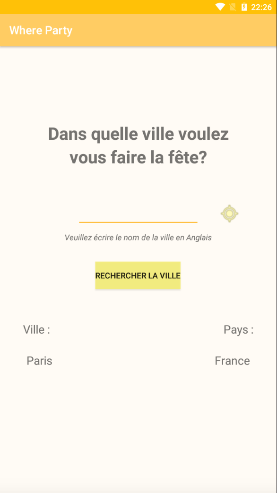
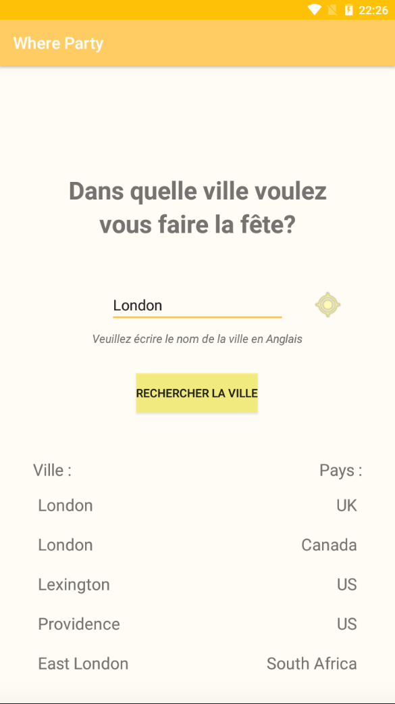

# Application Where Party

## Présentation :

Projet d'une application Android dévellopée en java.

Cette application à pour but de trouver des évènements musicaux dans une ville proche ou que l'on recherche.

## Fonctionnalités :

### Ecran d'accueil

- Possibilité de rechercher un ville ou d'appuyez sur le bouton de localisation pour chercher les villes proches
- Si il y a les données d'une ville sauvegardé en cache cela affiche directement cette ville comme sur la première image

 

### Ecran de choix de l'évènement

- Affiche la liste des évènements en fonction de la ville choisit

- Pour un élement de la liste on peux :
	- Si l'on clique sur l'artiste : aller sur la page de l'artiste
	- Si l'on clique sur l'endroit : aller sur la page de la salle
	- Si l'on clique ailleurs : aller sur la page de l'évènement
	

### Ecrans d'inforamtion

- Voici des exemples de différents écrans pour l'évènement juste au dessus

  

## Aspect utilisé :

### Pré-requis :

- Ecran avec une liste d'éléments
- Ecran avec le détail d'un éléments 
- Appel WebService à une API Rest
- Stockage de données en cache

### Les plus :

- Architecture :
	- Singleton
	- Design Patterns
	- MVC
	- Principe SOLID
- Gitflow
- Design

### Autres :

- Utilisation de WebView (via Android Studio)
- Ajout d'une icon d'application personnalisé
- Troisième ecran

